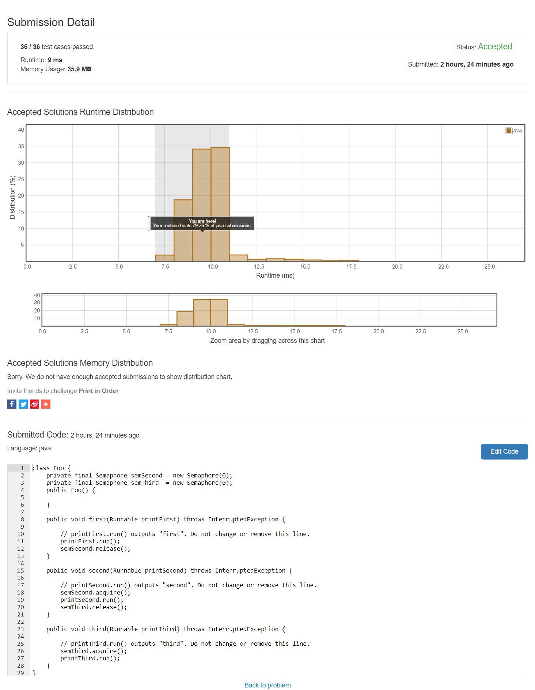

## 문제
Suppose we have a class:
```
public class Foo {
  public void first() { print("first"); }
  public void second() { print("second"); }
  public void third() { print("third"); }
}
```
The same instance of Foo will be passed to three different threads. Thread A will call first(), thread B will call second(), and thread C will call third(). Design a mechanism and modify the program to ensure that second() is executed after first(), and third() is executed after second().

**Example 1**:
  ```
  Input: [1,2,3]
  Output: "firstsecondthird"
  Explanation: There are three threads being fired asynchronously. The input [1,2,3] means thread A calls first(), thread B calls second(), and thread C calls third(). "firstsecondthird" is the correct output.
  ```
**Example 2**:
  ```
  Input: [1,3,2]
  Output: "firstsecondthird"
  Explanation: The input [1,3,2] means thread A calls first(), thread B calls third(), and thread C calls second(). "firstsecondthird" is the correct output.
  ```

Note:

We do not know how the threads will be scheduled in the operating system, even though the numbers in the input seems to imply the ordering. The input format you see is mainly to ensure our tests' comprehensiveness.

---
## 결과


---
## 해석
### 시간 복잡도
입력값 N에 대하여 알고리즘이 문제를 해결하는 데 얼마나 오랜 시간이 걸리는 지 분석하는 것
* O(1) : 알고리즘의 단계가 1단계
* O(log n) : 특정 단계마다 시간이 단축
* O(n) : 입력값과 동일한 시간
* O(n^2) : 입력값의 제곱
* O(2^n) : 입력값만큼의 제곱

O(1)부터 O(2^n)순으로 알고리즘 속도가 느려진다.  
결국 문제는 `O(log n)`의 속도를 요구한다.

### 중위값
중앙값이라고도 하며 자료(사료 혹은 변량)가 순서대로 정렬돼 있을 시 가운데 값이다.
  * 자료의 개수가 `짝수` - n/2, (n/2 + 1)
  * 자료의 개수가 `홀수` - (n + 1)/2
  
문제처럼 입력값이 [1, 2], [3, 4]일 경우 짝수개이므로
  * 4/2 = 2번재 인덱스
  * 4/2 - 1 = 1번째 인덱스 (인덱스가 0부터 시작하므로)
  
로 평균값을 구하면 `(2 + 3) / 2 = 2.5`가 나오게 된다.

### 소스
```kotlin
val arr = num1.plus(num2).sorted()
```
코틀린에서 배열의 `plus`는 인자로 받는 값을 리시버에 더해주는 역할을 하며 `sorted`는 정렬된 배열을 리턴한다.  
`sort`의 경우 해당 배열 자체를 정렬하는 함수이므로 헷갈리지 않도록 한다.
